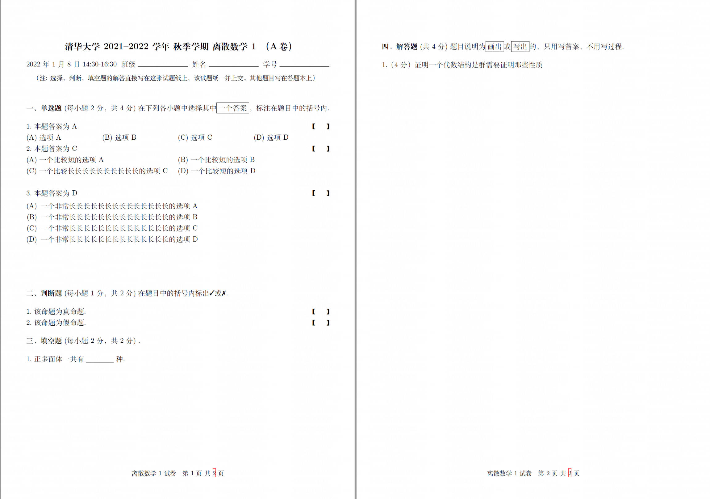
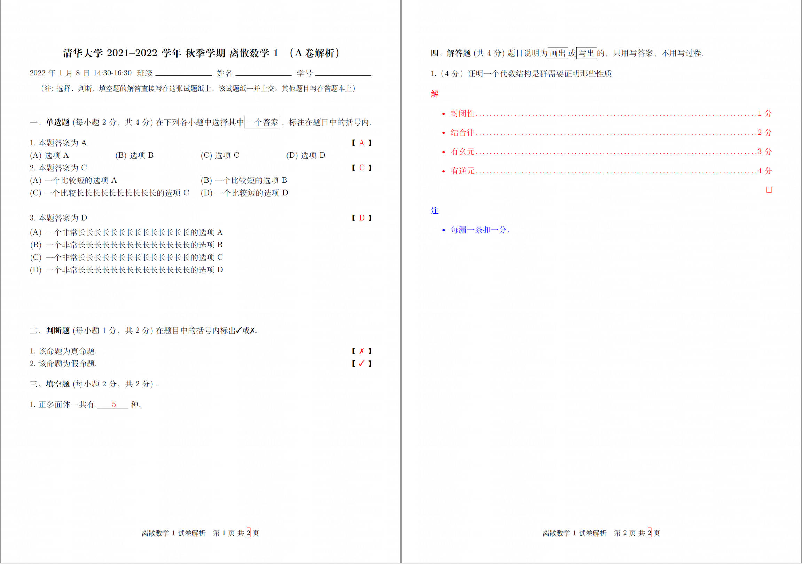

## 清华大学试卷 LaTeX 模板

改编自 [北京科技大学试卷 LaTeX 模板](https://github.com/htharoldht/USTBExam), 完全支持overleaf，并做了一些功能上的改进。不过也有一些功能没有很好的支持（比如AB卷打乱试题），欢迎PR！

#### 注意事项

- Overleaf 上请选择 `xeLaTeX` 为编译器
- `\documentclass[answer]{THUExam}`和`\documentclass[]{THUExam}` 决定是否渲染答案

#### 效果展示

